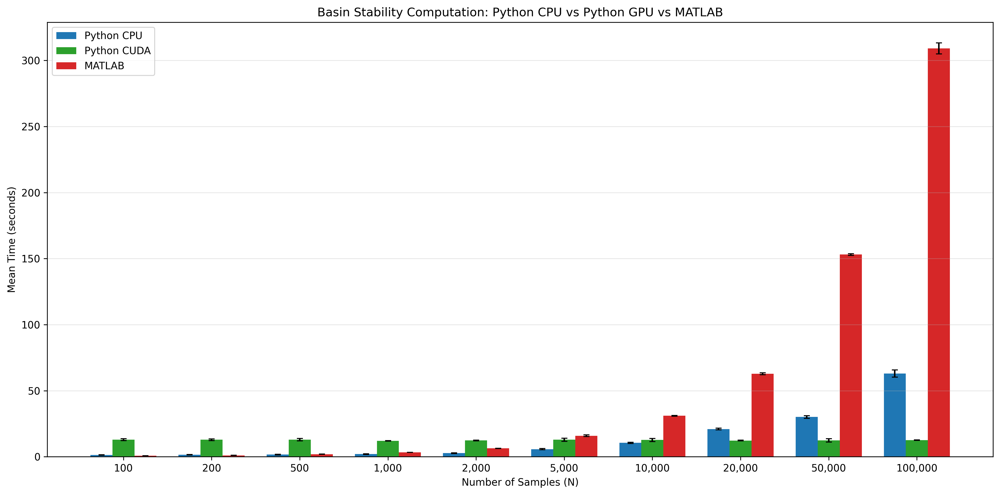
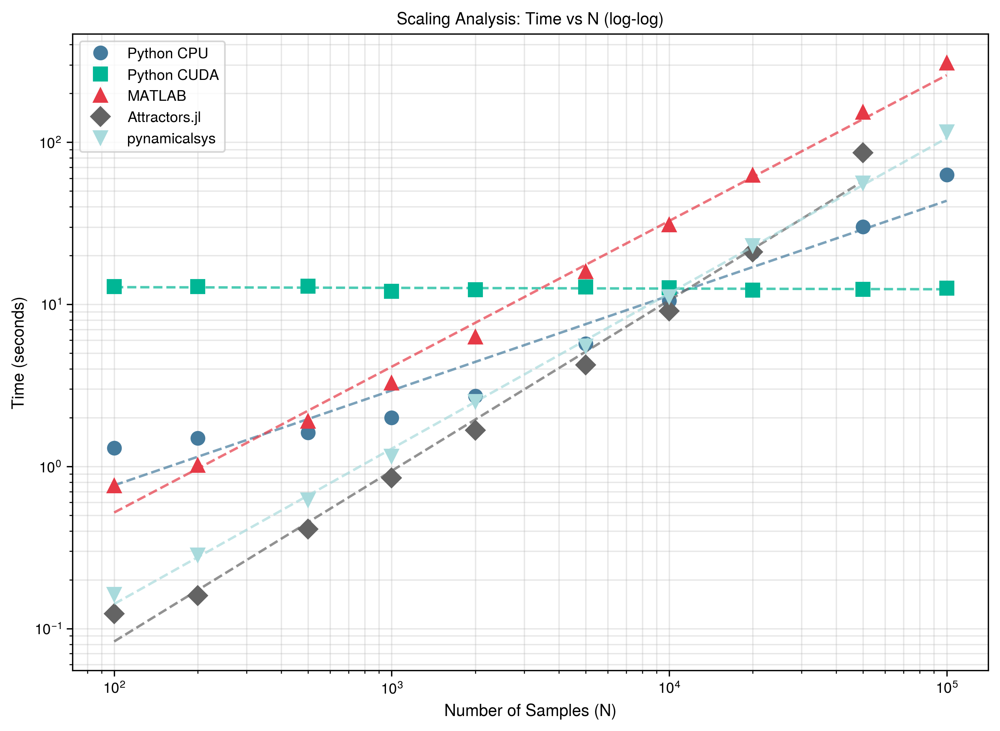

# End-to-End Performance

This benchmark compares the full basin stability estimation pipeline across MATLAB and Python implementations.

## Methodology

All implementations use the same:

- **ODE system**: Damped driven pendulum
- **Parameters**: `α=0.1`, `T=0.5`, `K=1.0`
- **Integration**: `t_span=(0, 1000)`, `rtol=1e-8`, `atol=1e-6`
- **Sample sizes**: 100 to 100,000 initial conditions

## Implementations Compared

| Implementation | Platform | Parallelization     |
| -------------- | -------- | ------------------- |
| MATLAB bSTAB-M | CPU      | MATLAB `parfor`     |
| pyBasin + JAX  | CPU      | Vectorized (`vmap`) |
| pyBasin + JAX  | CUDA GPU | Vectorized (`vmap`) |
| Attractors.jl  | CPU      | Threaded            |

## Results

### Performance Comparison

{{ benchmark_comparison_table() }}

!!! note "Attractors.jl memory limit"
Attractors.jl is not benchmarked at N=100,000. The `GroupViaClustering` (DBSCAN) step
allocates a full N×N pairwise distance matrix, requiring ~80 GB of RAM at that scale.
The practical ceiling on this machine is N=50,000 (~20 GB).

### Scaling Analysis

{{ benchmark_scaling_analysis() }}

### Comparison Plot

### Scaling Plot (Log-Log)

## Key Findings

1. **Python CPU** becomes **3-5× faster** than MATLAB for N > 5,000
2. **Python CUDA** achieves near-constant time (~12s) regardless of N due to GPU parallelization
3. At N=100,000: GPU is **~25× faster** than MATLAB (as long as data fits in GPU memory)
4. **Attractors.jl** scales linearly (O(N)) and matches Python CPU throughput up to N=50,000

## Hardware

Benchmarks run on:

- **CPU**: Intel Core Ultra 9 275HX
- **GPU**: NVIDIA GeForce RTX 5070 Ti Laptop GPU (12 GB VRAM)
