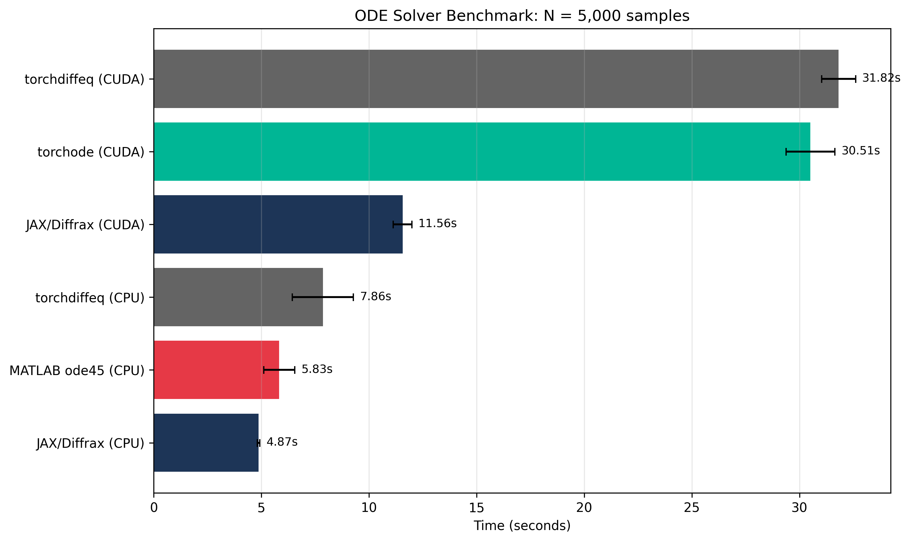
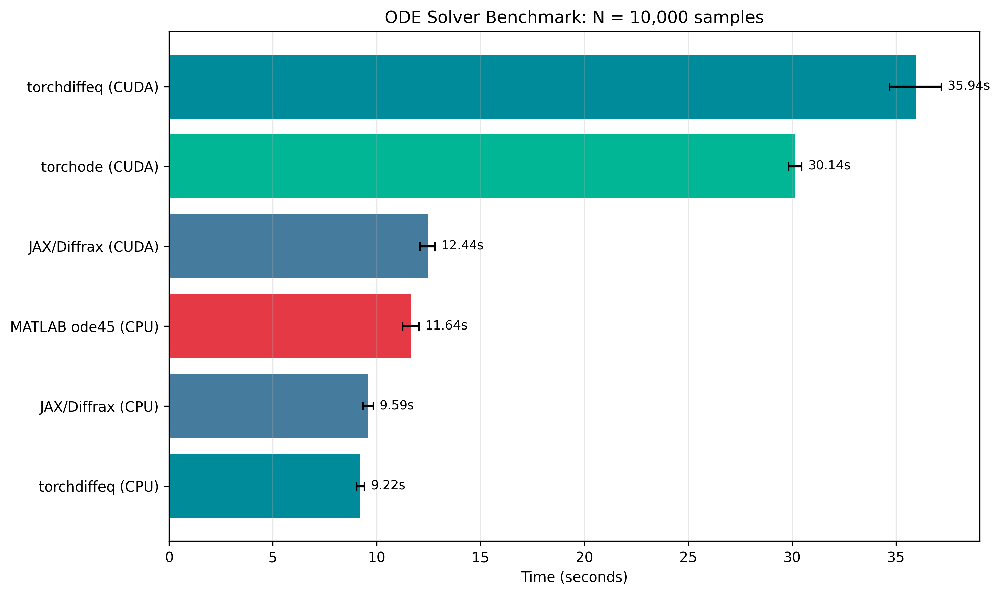
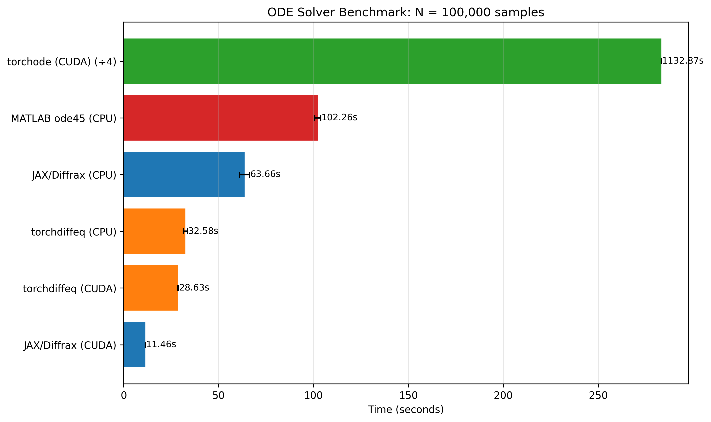

# Solver Comparison

This benchmark compares ODE solver performance across different Python backends and MATLAB.

## Test Configuration

- **ODE**: Driven damped pendulum
- **t_span**: (0, 1000)
- **Tolerances**: rtol=1e-8, atol=1e-6
- **Sample sizes**: 5,000 / 10,000 / 100,000 initial conditions

## Solvers Tested

| Solver       | Backend | Devices   | Method              |
| ------------ | ------- | --------- | ------------------- |
| MATLAB ode45 | MATLAB  | CPU       | Dormand-Prince 5(4) |
| JAX/Diffrax  | JAX     | CPU, CUDA | Dormand-Prince 5(4) |
| torchdiffeq  | PyTorch | CPU, CUDA | Dormand-Prince 5(4) |
| torchode     | PyTorch | CUDA      | Dormand-Prince 5(4) |

!!! warning "TorchOde Performance Issues"
TorchOde was excluded from CPU benchmarks due to severe performance issues observed in previous runs.
Additionally, it performs very poorly at larger N values (e.g., ~1133s at N=100k vs ~11s for JAX/Diffrax),
indicating it is not properly optimized for GPU batch processing in this use case.

## Results by Sample Size

{{ solver_comparison_table() }}

## Comparison Plots

### N = 5,000

### N = 10,000

### N = 100,000

_Note: torchode (CUDA) time is divided by 3 in the N=100,000 plot to improve readability._

_Note: the first round of torchode tooks 2x longer than any following run inflating the average. The real average duration is around 310 seconds_

## Key Findings

1. **JAX/Diffrax (CPU)** is the fastest option for small to medium N (5k-10k samples)
2. **JAX/Diffrax (CUDA)** achieves near-constant time (~11.5s) regardless of N, making it **8.9x faster** than MATLAB at N=100k
3. **torchdiffeq** scales reasonably well on both CPU and CUDA
4. GPU acceleration only provides significant benefit at large sample sizes (N ≥ 100k)
5. At small N, GPU overhead makes CPU solvers faster

## Recommendations

**JAX/Diffrax should be the default solver for pyBasin.** When a GPU is available, it delivers
unmatched performance with near-constant integration time regardless of sample size—making it
the clear choice for any workload.

Additionally, JAX/Diffrax is the only solver that supports **event-based termination with individual
trajectory stopping**. This is critical for systems with unbounded trajectories (e.g., Lorenz "broken
butterfly"), where some initial conditions diverge to infinity. With JAX events, each trajectory stops
independently when it exceeds a threshold, while bounded trajectories continue integrating. Other solvers
either stop all trajectories simultaneously or require workarounds like zero masking. See the
[Handling Unbounded Trajectories](../guides/unbounded-trajectories.md) guide for details.

For CPU-only systems, the choice depends on scale. At smaller sample sizes (N ≤ 10k), JAX/Diffrax
on CPU is the fastest option. **However, at larger scales (N = 100k), torchdiffeq on CPU offers a
meaningful ~2x improvement over JAX/Diffrax CPU (32s vs 64s)** . While this difference is negligible
for single runs, it becomes significant for parameter studies that require evaluating many ODE
configurations. A study testing 50 parameter combinations at N=100k would save roughly 26 minutes
by using torchdiffeq instead of JAX/Diffrax on CPU—though JAX/Diffrax on GPU would complete the
same workload in just 10 minutes.

## Hardware

Benchmarks run on:

- **CPU**: Intel Core Ultra 9 275HX
- **GPU**: NVIDIA GeForce RTX 5070 Ti Laptop GPU (12 GB VRAM)
