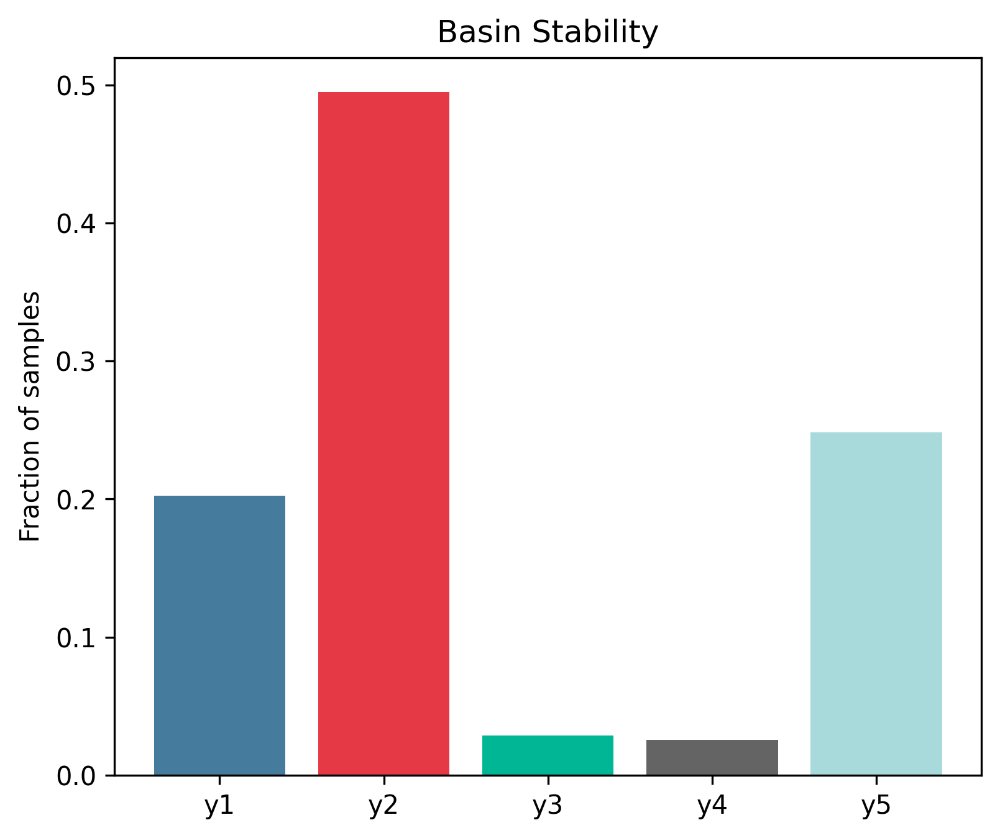
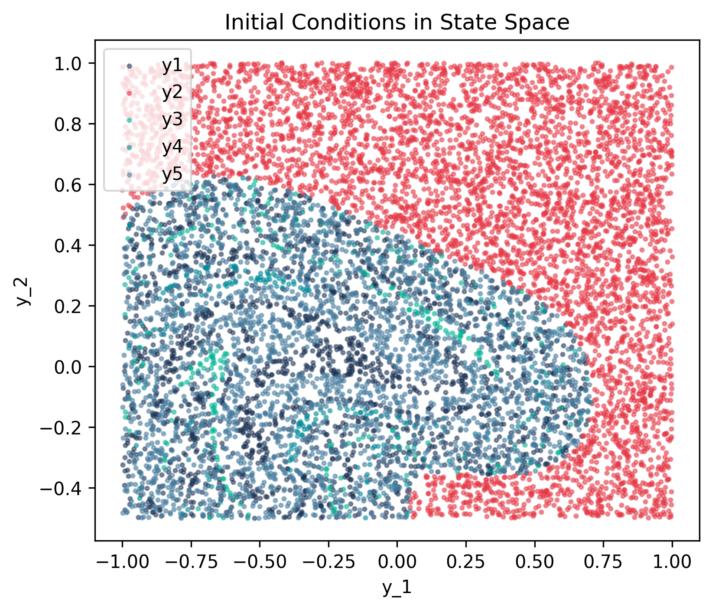
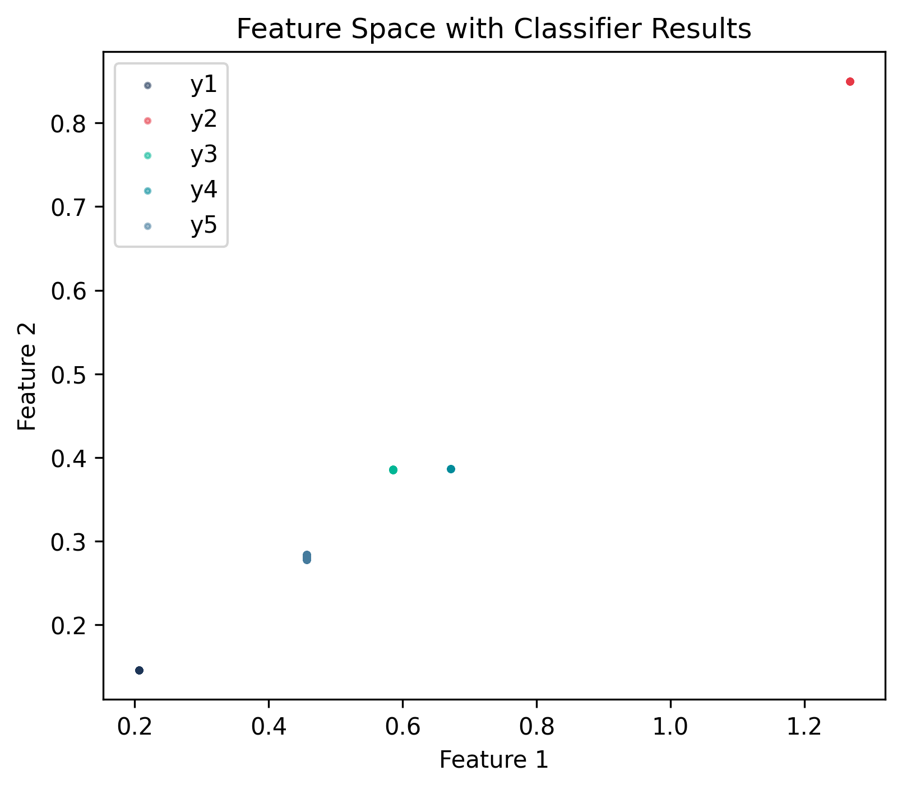

# Duffing Oscillator

## System Description

Duffing oscillator with cubic nonlinearity:

$$\ddot{x} + \delta \dot{x} + \alpha x + \beta x^3 = \gamma \cos(\omega t)$$

## Attractors

- **y1-y5**: Various n-cycle attractors (period-n oscillations)

## Reproduction Code

### Setup

{{ load_snippet("case_studies/duffing_oscillator/setup_duffing_oscillator_system.py::setup_duffing_oscillator_system") }}

### Main Estimation

{{ load_snippet("case_studies/duffing_oscillator/main_duffing_case1.py::main") }}

## Case 1: Baseline Results (Supervised)

### Comparison with MATLAB bSTAB

{{ comparison_table("duffing_case1") }}

### Visualizations

#### Basin Stability

#### State Space

#### Feature Space

## Case 2: Unsupervised Clustering with Template Relabeling

This case demonstrates unsupervised attractor discovery using DBSCAN clustering, followed by relabeling using KNN template matching to assign meaningful attractor names.

### Comparison with MATLAB bSTAB

{{ comparison_table("duffing_case2") }}

### Visualizations

#### Basin Stability

#### State Space

#### Feature Space

