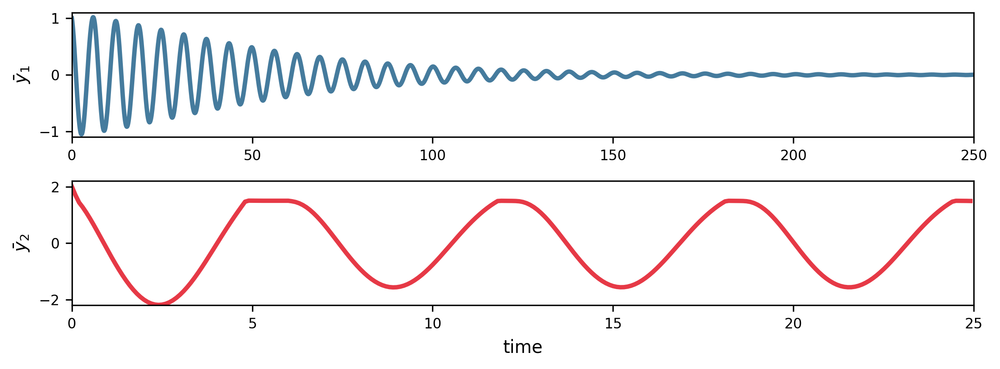

# Friction Oscillator

## System Description

Self-excited friction oscillator with Stribeck friction characteristic:

$$
\begin{aligned}
\dot{x} &= v \\
\dot{v} &= -2\xi v - \mu(v_{\text{rel}}) \cdot \text{sgn}(v_{\text{rel}})
\end{aligned}
$$

where $v_{\text{rel}} = v - v_d$ and the friction characteristic is:

$$
\mu(v_{\text{rel}}) = \mu_d + (\mu_{sd} - 1)\mu_d \exp\left(-\frac{|v_{\text{rel}}|}{v_0}\right) + \mu_v |v_{\text{rel}}|
$$

### System Parameters

| Parameter            | Symbol     | Value |
| -------------------- | ---------- | ----- |
| Driving velocity     | $v_d$      | 1.5   |
| Damping ratio        | $\xi$      | 0.05  |
| Static/dynamic ratio | $\mu_{sd}$ | 2.0   |
| Dynamic friction     | $\mu_d$    | 0.5   |
| Viscous friction     | $\mu_v$    | 0.0   |
| Reference velocity   | $v_0$      | 0.5   |

### Sampling

- **Dimension**: $D = 2$
- **Sample size**: $N = 5000$
- **Distribution**: $\rho$ = Uniform
- **Region of interest**: $\mathcal{Q}(x, v) : [-2, 2] \times [0, 2]$

### Solver

| Setting            | Value              |
| ------------------ | ------------------ |
| Method             | Dopri5 (Diffrax)   |
| Time span          | $[0, 500]$         |
| Steps              | 500 ($f_s$ = 1 Hz) |
| Relative tolerance | 1e-08              |
| Absolute tolerance | 1e-06              |

!!! note "Implementation detail"
The JAX implementation uses a $\tanh$ approximation for the sign function with $k_{\text{smooth}} = 200$, while MATLAB uses hard switching.

### Feature Extraction

Maximum absolute velocity after transient:

- States: $v$ (state 1)
- Formula: $\max(|v|)$, threshold = 0.2 (FP if $\leq 0.2$, LC otherwise)
- Transient cutoff: $t^* = 400.0$

### Clustering

- **Method**: k-NN (k=1)
- **Template ICs**:
  - FP: $[1.0, 1.0]$ — Fixed point (stable fixed point of steady sliding)
  - LC: $[2.0, 2.0]$ — Limit cycle (stick-slip oscillation)

## Reproduction Code

### Setup

{{ load_snippet("case_studies/friction/setup_friction_system.py::setup_friction_system") }}

### Main Estimation

{{ load_snippet("case_studies/friction/main_friction.py::main") }}

## Case 1: Baseline Results

### Comparison with MATLAB bSTAB

{{ comparison_table("friction_case1") }}

### Visualizations

#### Basin Stability

#### State Space

#### Feature Space

#### Template Trajectories

## Case 2: v_d Parameter Sweep

### Comparison with MATLAB bSTAB

{{ comparison_table("friction_case2") }}

### Visualizations

#### Basin Stability Variation

#### Bifurcation Diagram

