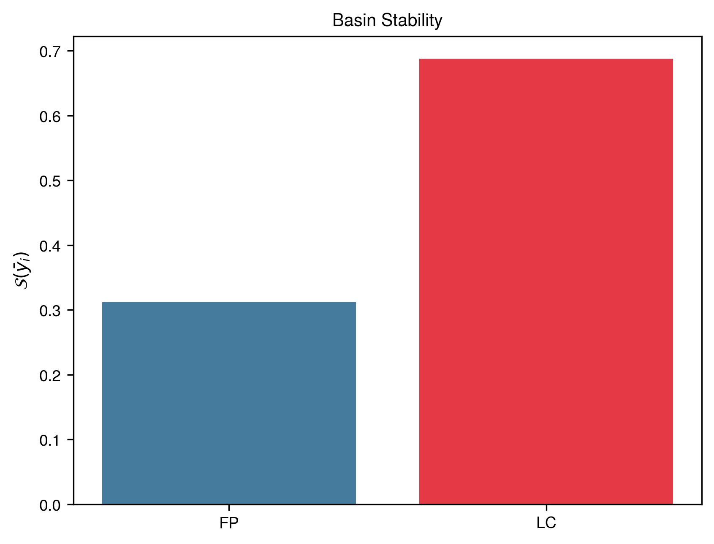
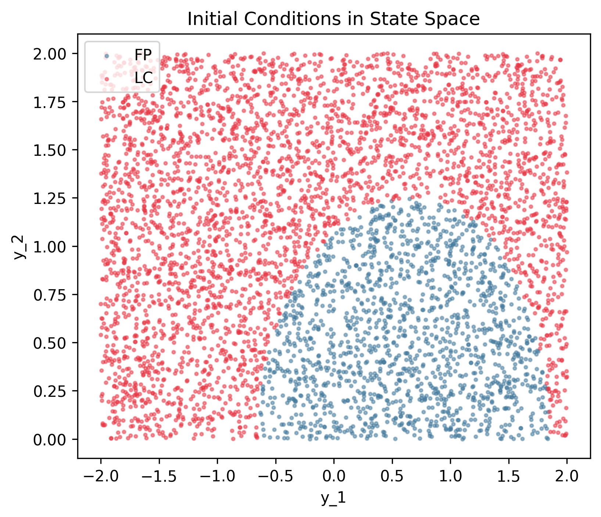
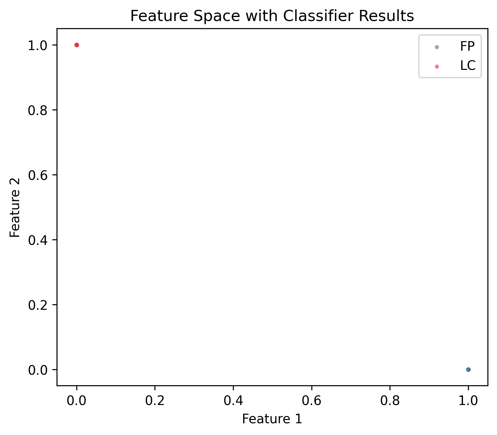
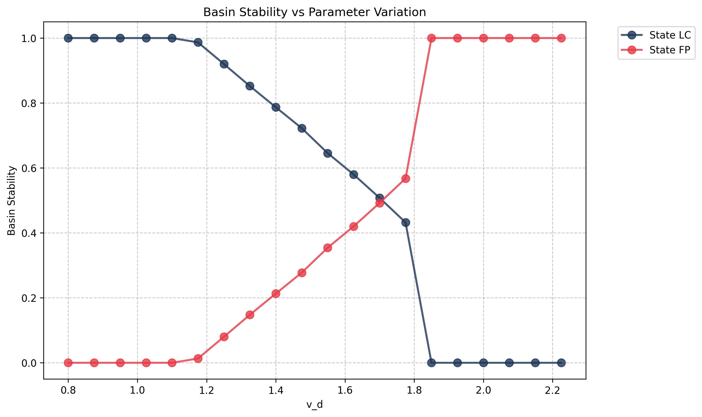
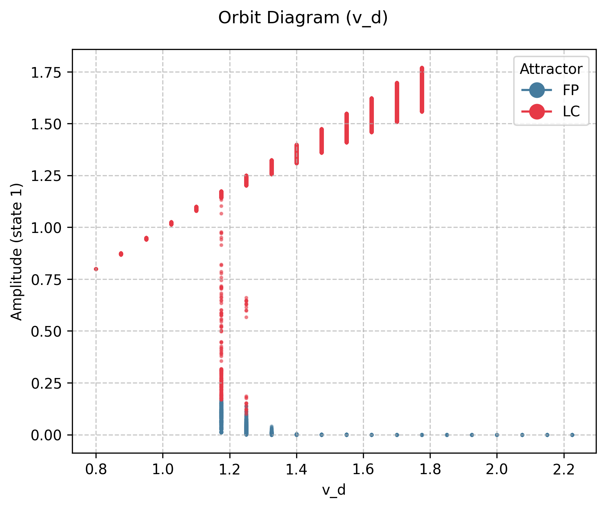

# Friction Oscillator

## System Description

Mass-spring-damper with friction:

$$m\ddot{x} + c\dot{x} + kx = F_{friction}(v_{belt} - \dot{x})$$

## Attractors

- **FP**: Fixed point (stick state)
- **LC**: Limit cycle (stick-slip oscillation)

## Reproduction Code

### Setup

{{ load_snippet("case_studies/friction/setup_friction_system.py::setup_friction_system") }}

### Main Estimation

{{ load_snippet("case_studies/friction/main_friction.py::main") }}

## Case 1: Baseline Results

### Comparison with MATLAB bSTAB

{{ comparison_table("friction_case1") }}

### Visualizations

#### Basin Stability

#### State Space

#### Feature Space

## Case 2: v_d Parameter Sweep

### Comparison with MATLAB bSTAB

{{ comparison_table("friction_case2") }}

### Visualizations

#### Basin Stability Variation

#### Bifurcation Diagram

