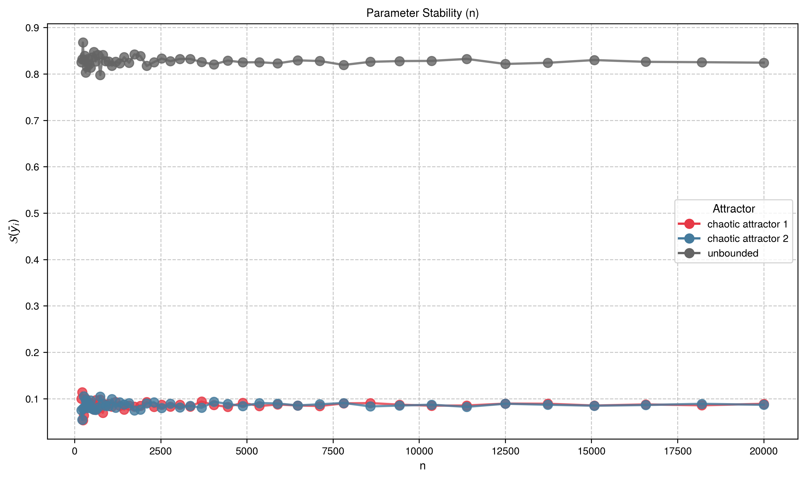
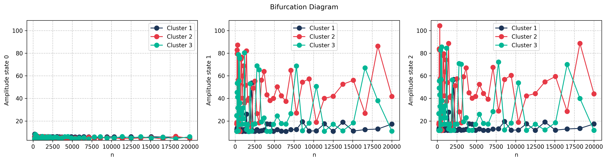

# Lorenz System

## System Description

Lorenz system:

$$
\begin{aligned}
\dot{x} &= \sigma(y - x) \\
\dot{y} &= rx - xz - y \\
\dot{z} &= xy - bz
\end{aligned}
$$

### System Parameters

| Parameter        | Symbol   | Value |
| ---------------- | -------- | ----- |
| Prandtl number   | $\sigma$ | 0.12  |
| Rayleigh number  | $r$      | 0.0   |
| Geometric factor | $b$      | -0.6  |

### Sampling

- **Dimension**: $D = 3$
- **Sample size**: $N = 20000$
- **Distribution**: $\rho$ = Uniform
- **Region of interest**: $\mathcal{Q}(x, y, z) : [-10, 10] \times [-20, 20] \times [0]$

### Solver

| Setting            | Value                               |
| ------------------ | ----------------------------------- |
| Method             | Dopri5 (Diffrax)                    |
| Time span          | $[0, 1000]$                         |
| Steps              | 4000 ($f_s$ = 4 Hz)                 |
| Relative tolerance | 1e-08                               |
| Absolute tolerance | 1e-06                               |
| Event function     | Divergence at $\vert y \vert > 200$ |

### Feature Extraction

Mean of $x$ coordinate after transient:

- States: $x$ (state 0)
- Formula: $\bar{x} = \text{mean}(x_{t > t^*})$
- Transient cutoff: $t^* = 900.0$

### Clustering

- **Method**: k-NN (k=1)
- **Template ICs**:
  - chaotic attractor 1: $[0.8, -3.0, 0.0]$ — Positive wing chaotic attractor
  - chaotic attractor 2: $[-0.8, 3.0, 0.0]$ — Negative wing chaotic attractor
  - unbounded: $[10.0, 50.0, 0.0]$ — Diverging trajectories

!!! note "Key Feature"
Demonstrates unboundedness detection with `event_fn`.

## Reproduction Code

### Setup

{{ load_snippet("case_studies/lorenz/setup_lorenz_system.py::setup_lorenz_system") }}

### Main Estimation

{{ load_snippet("case_studies/lorenz/main_lorenz.py::main") }}

## Case 1: Baseline Results

### Comparison with MATLAB bSTAB

{{ comparison_table("lorenz_case1") }}

### Visualizations

#### Basin Stability

#### State Space

#### Feature Space

#### Template Phase Space

## Case 2: Sigma Parameter Sweep

### Comparison with MATLAB bSTAB

{{ comparison_table("lorenz_case2") }}

### Visualizations

#### Basin Stability Variation

#### Bifurcation Diagram

## Case 3: Solver rtol Convergence Study

This hyperparameter study demonstrates the effect of ODE solver relative tolerance on basin stability estimation. Coarse tolerances (rtol=1e-3) produce inaccurate results, while finer tolerances converge to consistent values.

### Comparison with MATLAB bSTAB

{{ comparison_table("lorenz_case3") }}

### Visualizations

#### Basin Stability Variation

#### Bifurcation Diagram

## Case 4: Sample Size Convergence Study

This hyperparameter study varies the number of initial conditions $N$ from 200 to 20,000 (using $2 \times \text{logspace}(2, 4, 50)$) to assess how basin stability estimates converge as sample size increases. The relative standard error decreases as $\text{SE}/\mathcal{S}_{\mathcal{B}} \sim 1/\sqrt{N}$.

### Comparison with MATLAB bSTAB

{{ comparison_table("lorenz_case4") }}

### Visualizations

#### Basin Stability Variation

#### Bifurcation Diagram

