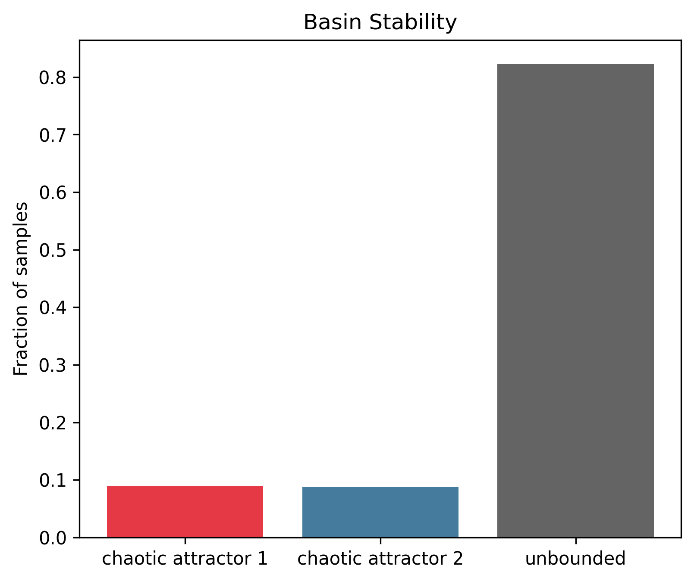
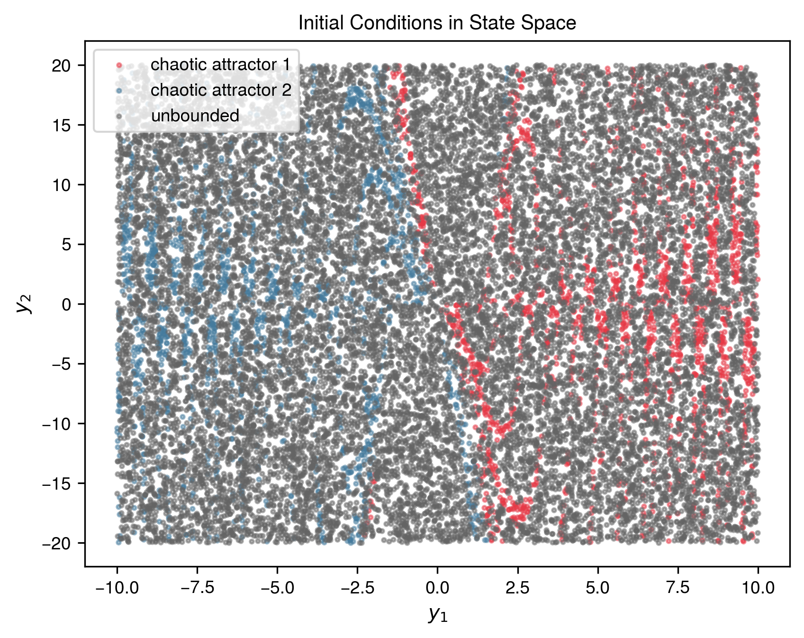
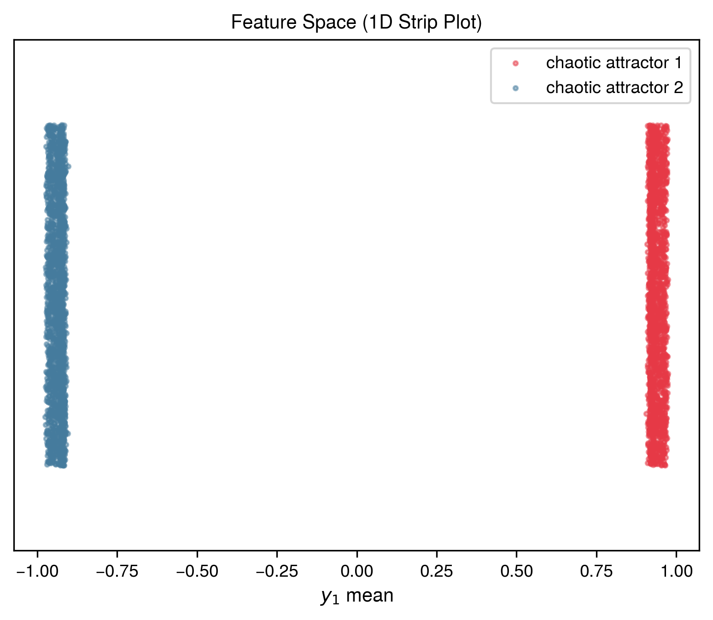
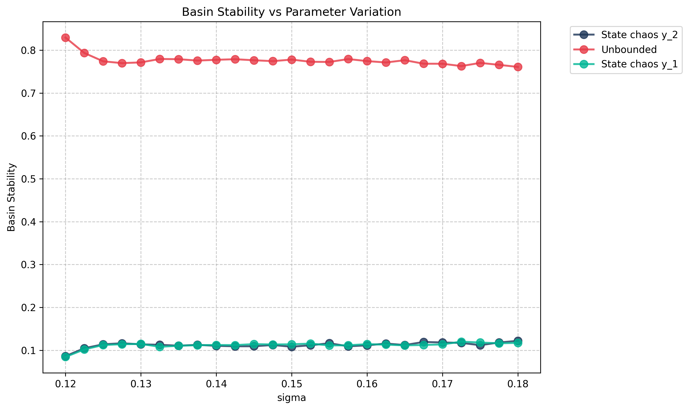
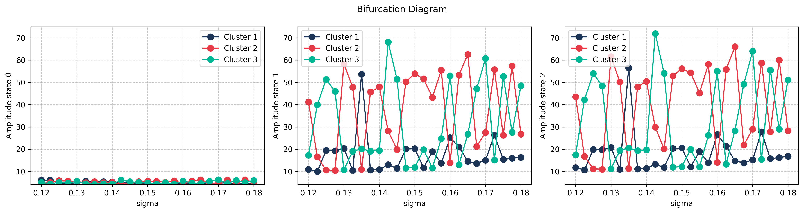
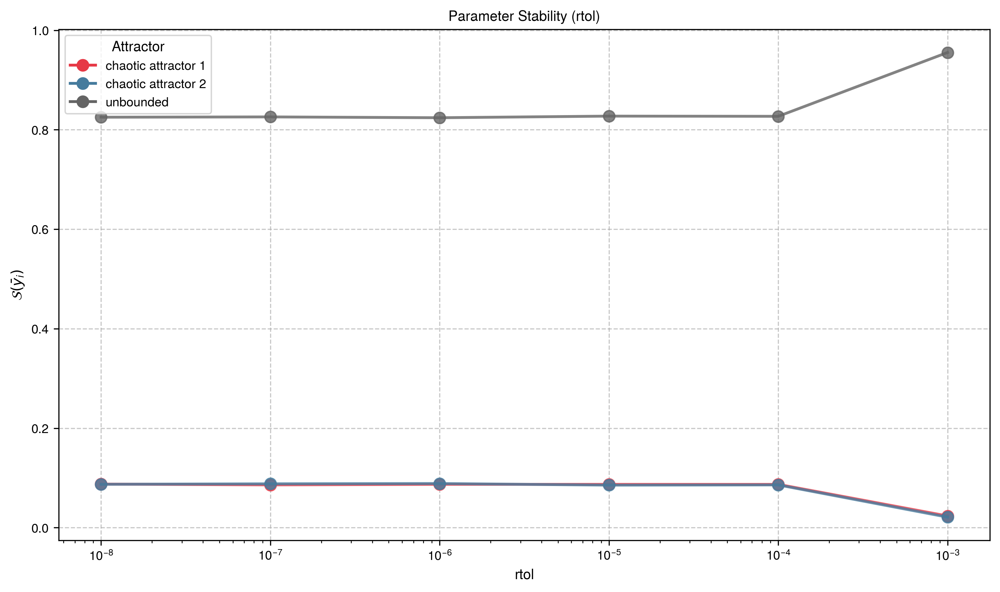
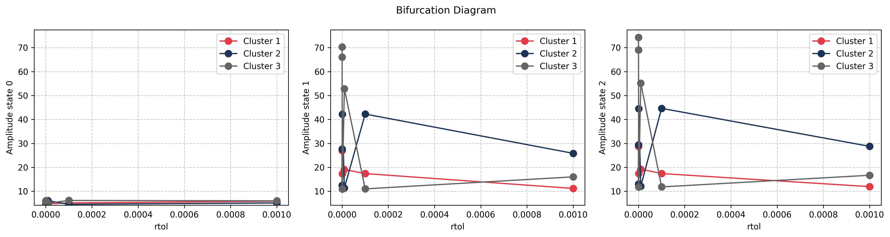

# Lorenz System

## System Description

Lorenz "broken butterfly" attractor:

$$
\begin{aligned}
\dot{x} &= \sigma(y - x) \\
\dot{y} &= rx - y - xz \\
\dot{z} &= xy - bz
\end{aligned}
$$

## Attractors

- **chaos y_1**: Positive x wing (butterfly1)
- **chaos y_2**: Negative x wing (butterfly2)
- **unbounded**: Trajectories that escape to infinity

## Key Feature

Demonstrates unboundedness detection with `event_fn`.

## Reproduction Code

### Setup

{{ load_snippet("case_studies/lorenz/setup_lorenz_system.py::setup_lorenz_system") }}

### Main Estimation

{{ load_snippet("case_studies/lorenz/main_lorenz.py::main") }}

## Case 1: Baseline Results

### Comparison with MATLAB bSTAB

{{ comparison_table("lorenz_case1") }}

### Visualizations

#### Basin Stability

#### State Space

#### Feature Space

## Case 2: Sigma Parameter Sweep

### Comparison with MATLAB bSTAB

{{ comparison_table("lorenz_case2") }}

### Visualizations

#### Basin Stability Variation

#### Bifurcation Diagram

## Case 3: Solver rtol Convergence Study

This hyperparameter study demonstrates the effect of ODE solver relative tolerance on basin stability estimation. Coarse tolerances (rtol=1e-3) produce inaccurate results, while finer tolerances converge to consistent values.

### Comparison with MATLAB bSTAB

{{ comparison_table("lorenz_case3") }}

### Visualizations

#### Basin Stability Variation

#### Bifurcation Diagram

