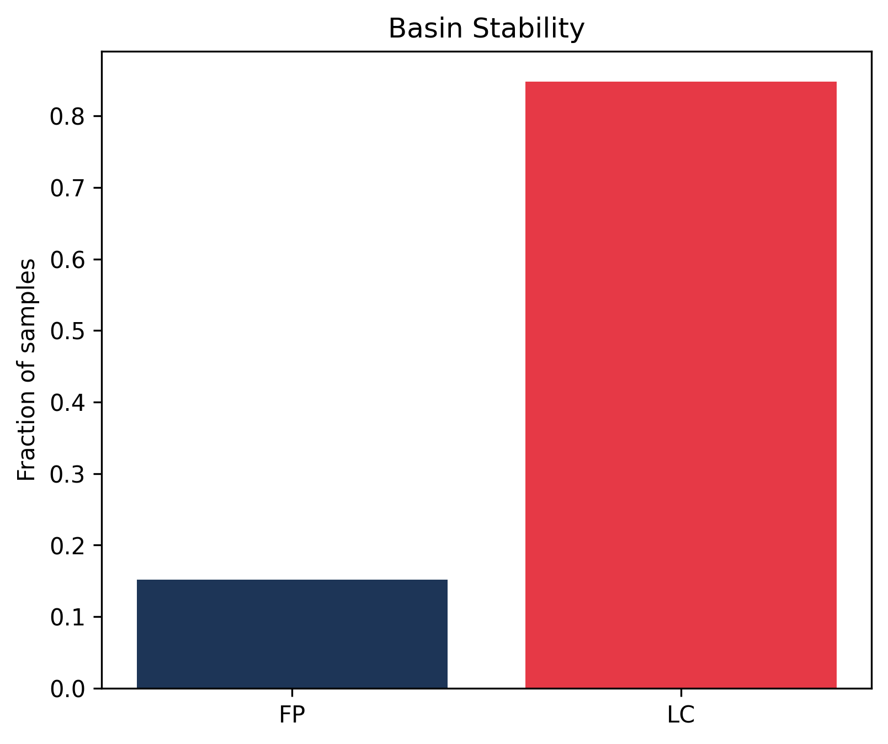
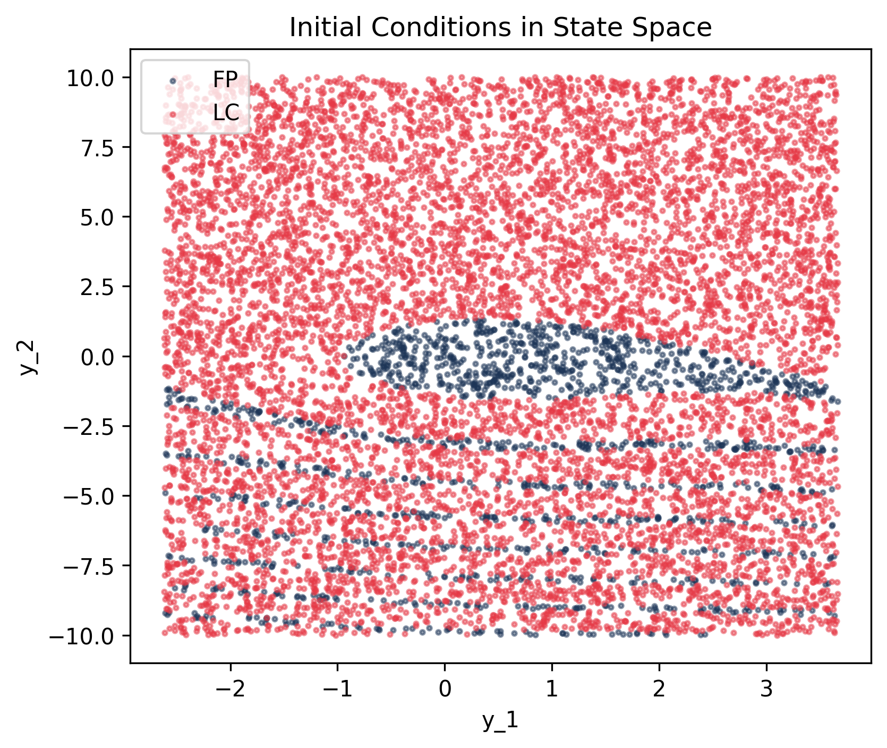
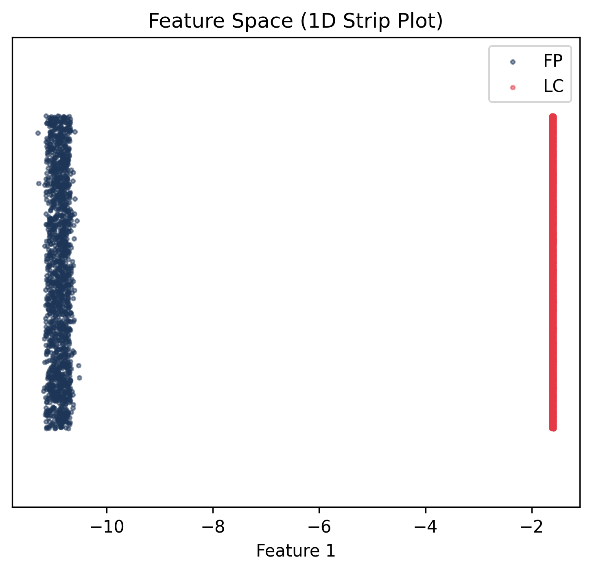
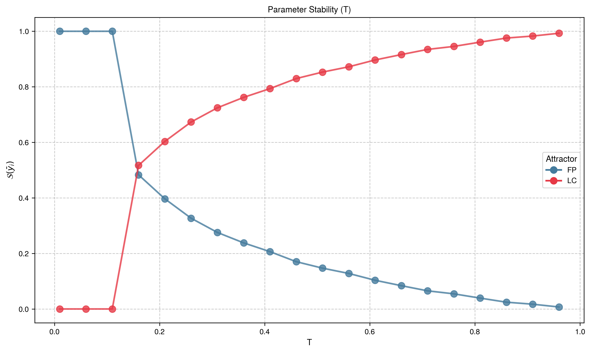
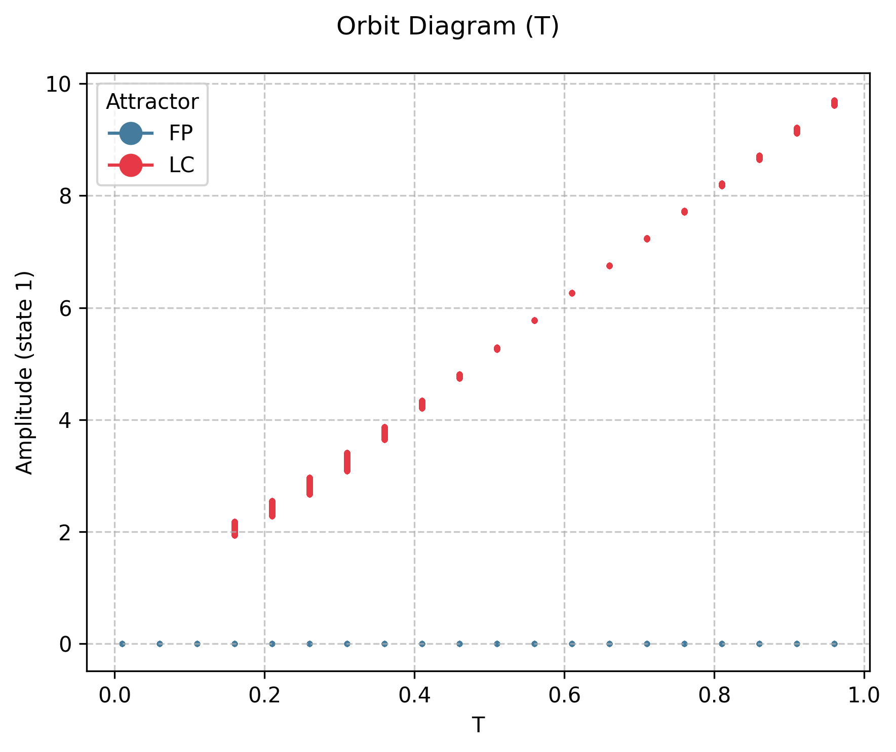

# Pendulum

## System Description

Driven damped pendulum:

$$\ddot{\theta} + \gamma \dot{\theta} + \sin(\theta) = A \cos(\omega t)$$

## Attractors

- **Fixed Point (FP)**: Pendulum settles to equilibrium
- **Limit Cycle (LC)**: Periodic oscillation

## Reproduction Code

### Setup

{{ load_snippet("case_studies/pendulum/setup_pendulum_system.py::setup_pendulum_system") }}

### Main Estimation

{{ load_snippet("case_studies/pendulum/main_pendulum_case1.py::main") }}

## Case 1: Baseline Results

### Comparison with MATLAB bSTAB

{{ comparison_table("pendulum_case1") }}

### Visualizations

#### Basin Stability

#### State Space

#### Feature Space

## Case 2: Parameter Sweep

### Comparison with MATLAB bSTAB

{{ comparison_table("pendulum_case2") }}

### Visualizations

#### Basin Stability Variation

#### Bifurcation Diagram

## Case 3: Sample Size Convergence Study

This hyperparameter study varies the number of initial conditions $N$ from ~50 to ~5000 (using $5 \times \text{logspace}(1, 3, 20)$) to assess how basin stability estimates converge as sample size increases. The relative standard error decreases as $\text{SE}/\mathcal{S}_{\mathcal{B}} \sim 1/\sqrt{N}$.

### Comparison with MATLAB bSTAB

{{ comparison_table("pendulum_case3") }}

### Visualizations

#### Basin Stability Variation

#### Bifurcation Diagram

