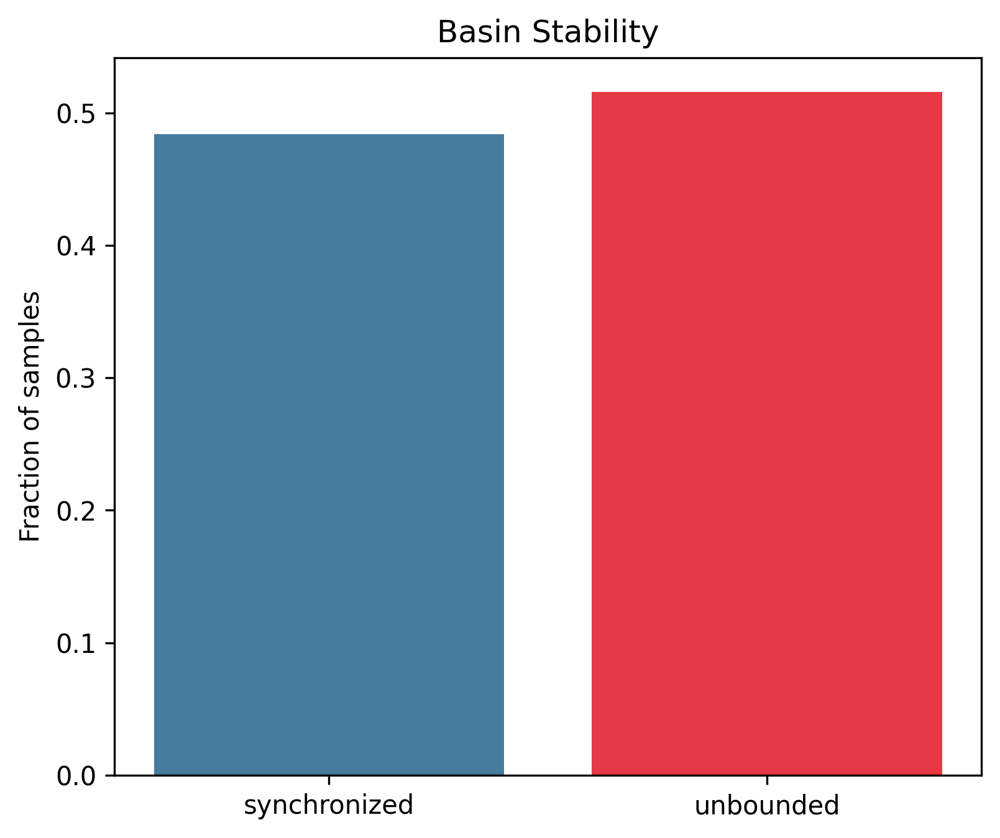
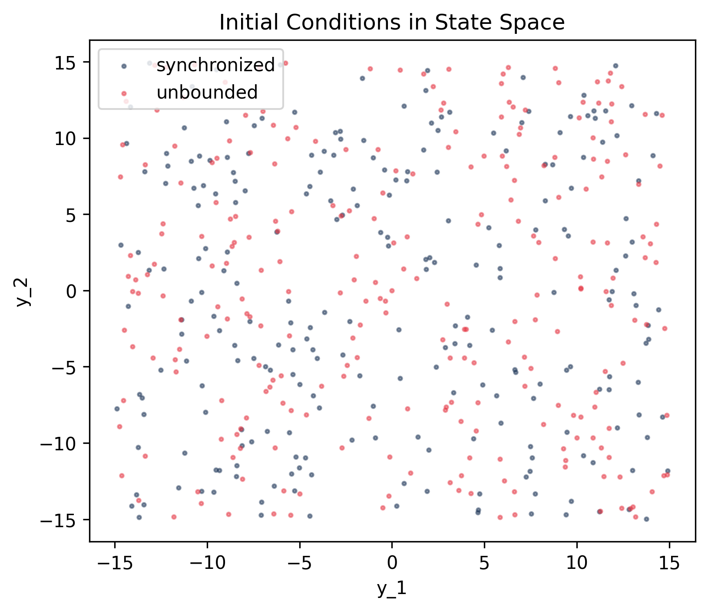
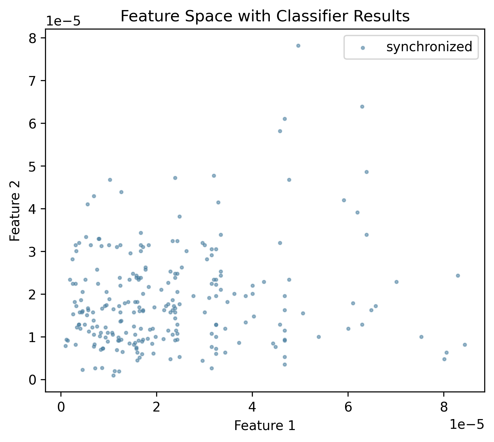
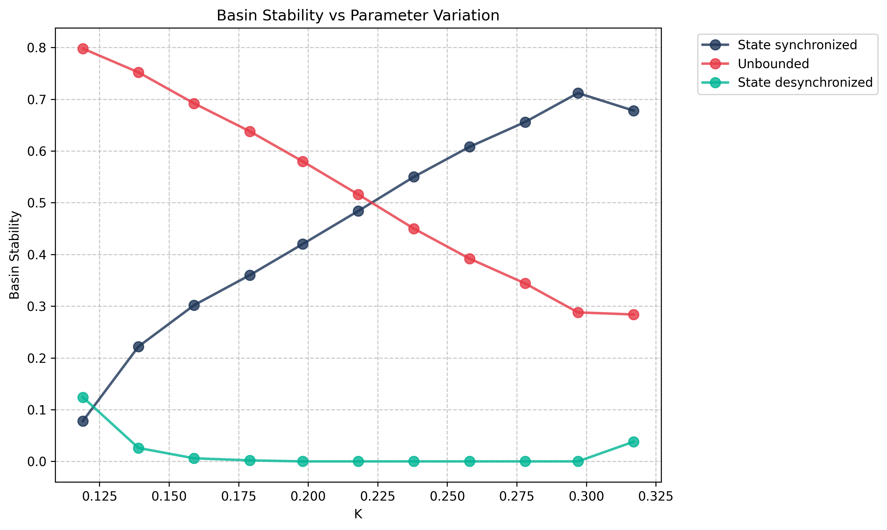

# Rössler Network

## System Description

Network of 100 coupled Rössler oscillators studying synchronization dynamics:

$$
\begin{aligned}
\dot{x}_i &= -y_i - z_i + K \sum_{j \in \mathcal{N}_i} (x_j - x_i) \\
\dot{y}_i &= x_i + ay_i \\
\dot{z}_i &= b + z_i(x_i - c)
\end{aligned}
$$

where $i = 1, \ldots, 100$ and $\mathcal{N}_i$ denotes the neighbors of node $i$ in the network.

**Parameters:**

- $a = 0.2$, $b = 0.2$, $c = 7.0$ (Rössler system parameters)
- $K$ = coupling strength (varied from 0.119 to 0.317)
- Network topology: Scale-free network with 100 nodes

## Attractors

The system exhibits three types of behavior:

- **Synchronized**: All oscillators converge to a common trajectory
- **Desynchronized**: Oscillators remain coupled but do not synchronize
- **Unbounded**: Some trajectories diverge to infinity

Basin stability is computed for non-unbounded states (synchronized + desynchronized).

## Key Features

This case study uses custom feature extraction and classification:

- **`SynchronizationFeatureExtractor`**: Computes maximum pairwise deviation across all node pairs
- **`SynchronizationClassifier`**: Classifies based on synchronization threshold

## Reproduction Code

### Setup

{{ load_snippet("case_studies/rossler_network/setup_rossler_network_system.py::setup_rossler_network_system") }}

### Single K Value

{{ load_snippet("case_studies/rossler_network/main_rossler_network.py::main") }}

### K Parameter Sweep

{{ load_snippet("case_studies/rossler_network/main_rossler_network_k_study.py::main") }}

## Baseline Results (K=0.218)

### Comparison with Paper Results

{{ comparison_table("rossler_network_baseline") }}

### Visualizations

#### Basin Stability

#### State Space

#### Feature Space

## K Parameter Sweep

### Comparison with Paper Results

{{ comparison_table("rossler_network_k_sweep") }}

### Visualizations

#### Basin Stability Variation

## References

Menck, P. J., Heitzig, J., Marwan, N., & Kurths, J. (2013). _How basin stability complements the linear-stability paradigm_. Nature Physics, 9(2), 89-92.
